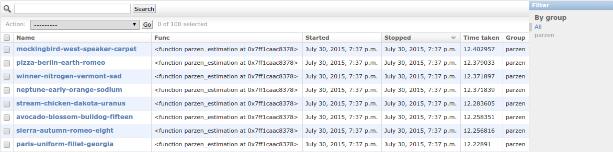
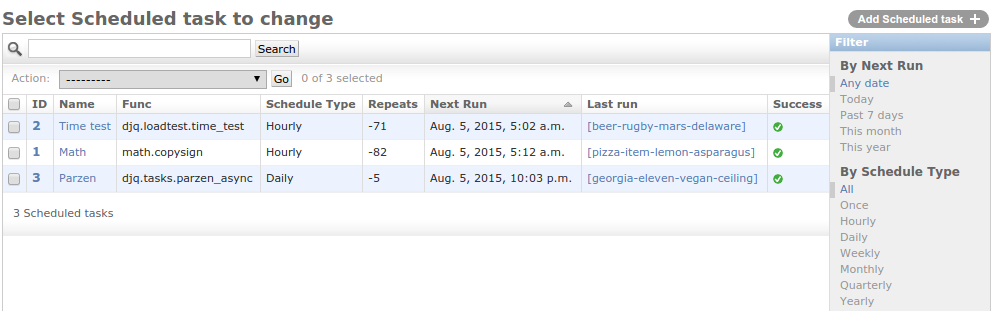

.. _admin_page:
.. py:currentmodule:: django_q

Admin pages
===========

Django Q does not use custom pages, but instead leverages what is offered by Django's model admin by default.
When you open Django Q's admin pages you will see three models:

Successful tasks
----------------

Shows all successfully executed tasks. Meaning they did not encounter any errors during execution.
From here you can look at details of each task or delete them. Use the group filter to filter your results by schedule name or group id.
The table is searchable by `name`, `func` and `group`

Uses the :class:`Success` proxy model.

.. tip::

    The maximum number of successful tasks can be set using the :ref:`save_limit` option.

Failed tasks
------------
Failed tasks have encountered an error, preventing them from finishing execution.
The worker will try to put the error in the `result` field of the task so you can review what happened.

You can resubmit a failed task back to the queue using the admins action menu.

Uses the :class:`Failure` proxy model

Customize the admin UI by creating your own ``admin.ModelAdmin`` class and use ``admin.site.unregister`` and ``admin.site.register`` to replace the default
for example:

.. code-block:: python

    from django_q import models as q_models
    from django_q import admin as q_admin

    admin.site.unregister([q_models.Failure])
    @admin.register(q_models.Failure)
    class ChildClassAdmin(q_admin.FailAdmin):
        list_display = (
            'name',
            'func',
            'result',
            'started',
            # add attempt_count to list_display
            'attempt_count'
        )

Scheduled tasks
---------------

Here you can check on the status of your scheduled tasks, create, edit or delete them.

Repeats
~~~~~~~
If you want a schedule to only run a finite amount of times, e.g. every hour for the next 24 hours, you can do that using the :attr:`Schedule.repeats` attribute.
In this case you would set the schedule type to :attr:`Schedule.HOURLY` and the repeats to `24`. Every time the schedule runs the repeats count down until it hits zero and schedule is no longer run.

When you set repeats to ``-1`` the schedule will continue indefinitely and the repeats will still count down. This can be used as an indicator of how many times the schedule has been executed.

An exception to this are schedules of type :attr:`Schedule.ONCE`. Negative repeats for this schedule type will cause it to be deleted from the database.
This behavior is useful if you have many delayed actions which you do not necessarily need a result for. A positive number will keep the ONCE schedule, but it will not run again.

You can pause a schedule by setting its repeats value to zero.

.. note::

    To run a ``ONCE`` schedule again, change the repeats to something other than `0`. Set a new run time before you do this or let it execute immediately.

Next run
~~~~~~~~

Shows you when this task will be added to the queue next.

Last run
~~~~~~~~

Links to the task result of the last scheduled run. Shows nothing if the schedule hasn't run yet or if task result has been deleted.

Success
~~~~~~~

Indicates the success status of the last scheduled task, if any.

.. note::

   if you have set the :ref:`save_limit` configuration option to not save successful tasks to the database, you will only see the failed results of your schedules.

Uses the :class:`Schedule` model

Queued tasks
------------
This admin view is only enabled when you use the :ref:`orm_broker` broker.
It shows all tasks packages currently in the broker queue. The ``lock`` column shows the moment at which this package was picked up by the cluster and is used to determine whether it has expired or not.
For development purposes you can edit and delete queued tasks from here.
