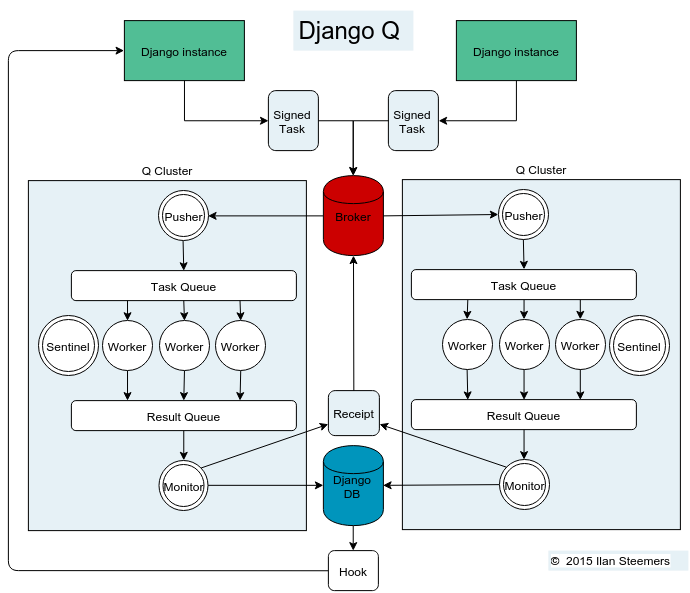

Architecture
------------

Signed Tasks
""""""""""""

Tasks are first pickled and then signed using Django's own :mod:`django.core.signing` module using the ``SECRET_KEY`` and cluster name as salt, before being sent to a message broker. This ensures that task
packages on the broker can only be executed and read by clusters
and django servers who share the same secret key and cluster name.
If a package fails to unpack, it will be marked failed with the broker and discarded.
Optionally the packages can be compressed before transport.

Broker
""""""

The broker collects task packages from the django instances and queues them for pick up by a cluster.
If the broker supports message receipts, it will keep a copy of the tasks around until a cluster acknowledges the processing of the task.
Otherwise it is put back in the queue after a timeout period. This ensure at-least-once delivery.
Most failed deliveries will be the result of a worker or the cluster crashing before the task was saved.

.. note::
   When the :ref:`ack_failures` option is set to ``False`` (the default), a task is
   considered a failed delivery when it raises an ``Exception``. Set
   this option to ``True`` to acknowledge failed tasks as successful.

Pusher
""""""

The pusher process continuously checks the broker for new task
packages. It checks the signing and unpacks the task to the internal Task Queue.
The amount of tasks in the Task Queue can be configured to control memory usage and minimize data loss in case of a failure.

Worker
""""""

A worker process pulls a task of the Task Queue and it sets a shared countdown timer with :ref:`sentinel` indicating it is about to start work.
The worker then tries to execute the task and afterwards the timer is reset and any results (including errors) are saved to the package.
Irrespective of the failure or success of any of these steps, the package is then pushed onto the Result Queue.

Monitor
"""""""

The result monitor checks the Result Queue for processed packages and
saves both failed and successful packages to the Django database or cache backend.
If the broker supports it, a delivery receipt is sent.
In case the task was part of a chain, the next task is queued.

.. _sentinel:

Sentinel
""""""""

The sentinel spawns all process and then checks the health of all
workers, including the pusher and the monitor. This includes checking timers on each worker for timeouts.
In case of a sudden death or timeout, it will reincarnate the failing processes. When a stop signal is received, the sentinel will halt the
pusher and instruct the workers and monitor to finish the remaining items. See :ref:`stop_procedure`

Timeouts
""""""""
Before each task execution the worker sets a countdown timer on the sentinel and resets it again after execution.
Meanwhile the sentinel checks if the timers don't reach zero, in which case it will terminate the worker and reincarnate a new one.

Scheduler
"""""""""
Twice a minute the scheduler checks for any scheduled tasks that should be starting.

- Creates a task from the schedule
- Subtracts 1 from :attr:`django_q.Schedule.repeats`
- Sets the next run time if there are repeats left or if it has a negative value.

.. _stop_procedure:

Stop procedure
""""""""""""""

When a stop signal is received, the sentinel exits the guard loop and instructs the pusher to stop pushing.
Once this is confirmed, the sentinel pushes poison pills onto the task queue and will wait for all the workers to exit.
This ensures that the task queue is emptied before the workers exit.
Afterwards the sentinel waits for the monitor to empty the result queue and the stop procedure is complete.

- Send stop event to pusher
- Wait for pusher to exit
- Put poison pills in the Task Queue
- Wait for all the workers to clear the queue and stop
- Put a poison pill on the Result Queue
- Wait for monitor to process remaining results and exit
- Signal that we have stopped

.. warning::
    If you force the cluster to terminate before the stop procedure has completed, you can lose tasks or results still being held in memory.
    You can manage the amount of tasks in a clusters memory by setting the :ref:`queue_limit`.
