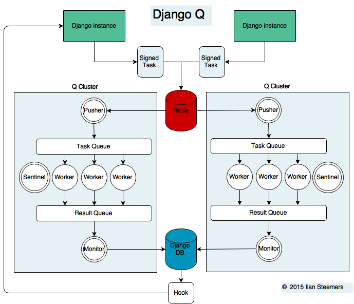

Cluster
=======
Django Q uses Python's multiprocessing module to manage a pool of workers that will handle your tasks.
Start your cluster using Django's `manage.py` command::

    $ python manage.py qcluster

You should  see something like this::

    10:57:40 [Q] INFO Q Cluster-31781 starting.
    10:57:40 [Q] INFO Process-1:1 ready for work at 31784
    10:57:40 [Q] INFO Process-1:2 ready for work at 31785
    10:57:40 [Q] INFO Process-1:3 ready for work at 31786
    10:57:40 [Q] INFO Process-1:4 ready for work at 31787
    10:57:40 [Q] INFO Process-1:5 ready for work at 31788
    10:57:40 [Q] INFO Process-1:6 ready for work at 31789
    10:57:40 [Q] INFO Process-1:7 ready for work at 31790
    10:57:40 [Q] INFO Process-1:8 ready for work at 31791
    10:57:40 [Q] INFO Process-1:9 monitoring at 31792
    10:57:40 [Q] INFO Process-1 guarding cluster at 31783
    10:57:40 [Q] INFO Process-1:10 pushing tasks at 31793
    10:57:40 [Q] INFO Q Cluster-31781 running.

Stopping the cluster with ctrl-c or either the `SIGTERM` and `SIGKILL` signals, will initiate the :ref:`stop_procedure`::

    16:44:12 [Q] INFO Q Cluster-31781 stopping.
    16:44:12 [Q] INFO Process-1 stopping cluster processes
    16:44:13 [Q] INFO Process-1:10 stopped pushing tasks
    16:44:13 [Q] INFO Process-1:6 stopped doing work
    16:44:13 [Q] INFO Process-1:4 stopped doing work
    16:44:13 [Q] INFO Process-1:1 stopped doing work
    16:44:13 [Q] INFO Process-1:5 stopped doing work
    16:44:13 [Q] INFO Process-1:7 stopped doing work
    16:44:13 [Q] INFO Process-1:3 stopped doing work
    16:44:13 [Q] INFO Process-1:8 stopped doing work
    16:44:13 [Q] INFO Process-1:2 stopped doing work
    16:44:14 [Q] INFO Process-1:9 stopped monitoring results
    16:44:15 [Q] INFO Q Cluster-31781 has stopped.

Using a Procfile
----------------
If you host on `Heroku <https://heroku.com>`__ or you are using `Honcho <https://github.com/nickstenning/honcho>`__ you can start the cluster from a :file:`Procfile` like this::

    worker: python manage.py qcluster

Architecture
------------

Signed Tasks
""""""""""""

Tasks are first pickled and then signed using Django's own
signing module before being sent to a Redis list. This ensures that task
packages on the Redis server can only be executed and read by clusters
and django servers who share the same secret key.
Optionally the packages can be compressed before transport

Pusher
""""""

The pusher process continuously checks the Redis list for new task
packages and pushes them on the Task Queue.

Worker
""""""

A worker process checks the package signing, unpacks the task, executes
it and saves the return value. Irrespective of the failure or success of
any of these steps, the package is then pushed onto the Result Queue.

Monitor
"""""""

The result monitor checks the Result Queue for processed packages and
saves both failed and successful packages to the Django database.

Sentinel
""""""""

The sentinel spawns all process and then checks the health of all
workers, including the pusher and the monitor. Reincarnating processes
if any may fail. In case of a stop signal, the sentinel will halt the
pusher and instruct the workers and monitor to finish the remaining
items. See :ref:`stop_procedure`

Timeouts
""""""""
Before each task execution the worker resets a timer on the sentinel and resets it again after execution.
Meanwhile the the sentinel checks if the timers don't exceed the timeout amount, in which case it will terminate the worker and reincarnate a new one.

Scheduler
"""""""""
Once a minute the scheduler checks for any scheduled task that should be starting.
It creates and queues a new task from the schedule and sets the next run date.

.. _stop_procedure:

Stop procedure
""""""""""""""

When a stop signal is given, the sentinel exits the guard loop and instructs the pusher to stop pushing.
Once this is confirmed, the sentinel pushes poison pills onto the task queue and will wait for all the workers to die.
This ensure that the queue is emptied before the workers exit.
Afterwards the sentinel waits for the monitor to empty the result queue before the stop procedure is complete.

- Send stop event to pusher
- Wait for pusher to exit
- Put poison pills in the Task Queue
- Wait for all the workers to clear the queue and stop
- Put a poison pill on the Result Queue
- Wait for monitor to stop

.. warning::
    If you force the cluster to terminate before the stop procedure has completed, you can lose tasks and their results.