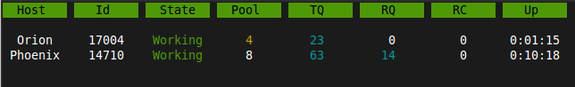
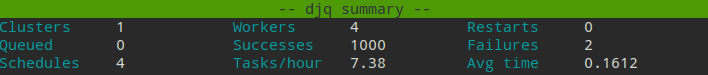

Monitor
=======
.. py:currentmodule::django_q.monitor

The cluster monitor shows live information about all the Q clusters connected to your project.

Start the monitor with Django's `manage.py` command::

    $ python manage.py qmonitor

For all broker types except the Redis broker, the monitor utilizes Django's cache framework to store statistics of running clusters.
This can be any type of cache backend as long as it can be shared among Django instances. For this reason, the local memory backend will not work.

Legend
------

Host
~~~~

Shows the hostname of the server this cluster is running on.

Id
~~

The cluster Id. Same as the cluster process ID or pid.

State
~~~~~

Current state of the cluster:

- **Starting** The cluster is spawning workers and getting ready.
- **Idle** Everything is ok, but there are no tasks to process.
- **Working** Processing tasks like a good cluster should.
- **Stopping** The cluster does not take on any new tasks and is finishing.
- **Stopped** All tasks have been processed and the cluster is shutting down.

Pool
~~~~

The current number of workers in the cluster pool.

TQ
~~

**Task Queue** counts the number of tasks in the queue [#f1]_

If this keeps rising it means you are taking on more tasks than your cluster can handle.
You can limit this by settings the :ref:`queue_limit` in your cluster configuration, after which it will turn green when that limit has been reached.
If your task queue is always hitting its limit and your running out of resources, it may be time to add another cluster.

RQ
~~

**Result Queue** shows the number of results in the queue. [#f1]_

Since results are only saved by a single process which has to access the database.
It's normal for the result queue to take slightly longer to clear than the task queue.

RC
~~

**Reincarnations** shows the amount of processes that have been reincarnated after a recycle, sudden death or timeout.
If this number is unusually high, you are either suffering from repeated task errors or severe timeouts and you should check your logs for details.

Up
~~

**Uptime** the amount of time that has passed since the cluster was started.

.. centered:: Press `q` to quit the monitor and return to your terminal.

Info
----

If you just want to see a one-off summary of your cluster stats you can use the `qinfo` management command::

    $ python manage.py qinfo

All stats are summed over all available clusters.

Task rate is calculated over the last 24 hours and will show the number of tasks per second, minute, hour or day depending on the amount.
Average execution time (`Avg time`) is calculated in seconds over the last 24 hours.

Since some of these numbers are based on what is available in your tasks database, limiting or disabling the result backend will skew them.

Like with the monitor, these statistics come from a Redis server or Django's cache framework. So make sure you have either one configured.

To print out the current configuration run::

    $ python manage.py qinfo --config

Status
------

You can check the status of your clusters straight from your code with the :class:`Stat` class:

.. code:: python

    from django_q.monitor import Stat

    for stat in Stat.get_all():
        print(stat.cluster_id, stat.status)

    # or if you know the cluster id
    cluster_id = 1234
    stat = Stat.get(cluster_id)
    print(stat.status, stat.workers)

Reference
---------

.. py:class:: Stat

   Cluster status object.

    .. py:attribute:: cluster_id

    Id of this cluster. Corresponds with the process id.

    .. py:attribute:: tob

    Time Of Birth

    .. py:method:: uptime

    Shows the number of seconds passed since the time of birth

    .. py:attribute:: reincarnations

    The number of times the sentinel had to start a new worker process.

    .. py:attribute:: status

    String representing the current cluster status.

    .. py:attribute:: task_q_size

    The number of tasks currently in the task queue. [#f1]_

    .. py:attribute:: done_q_size

    The number of tasks currently in the result queue. [#f1]_

    .. py:attribute:: pusher

    The pid of the pusher process

    .. py:attribute:: monitor

    The pid of the monitor process

    .. py:attribute:: sentinel

    The pid of the sentinel process

    .. py:attribute:: workers

    A list of process ids of the workers currently in the cluster pool.

    .. py:method:: empty_queues

    Returns true or false depending on any tasks still present in the task or result queue.

    .. py:classmethod:: get(cluster_id, broker=None)

    Gets the current :class:`Stat` for the cluster id. Takes an optional broker connection.

    .. py:classmethod:: get_all(broker=None)

    Returns a list of :class:`Stat` objects for all active clusters. Takes an optional broker connection.

.. rubric:: Footnotes

.. [#f1] Uses :meth:`multiprocessing.Queue.qsize()` which is not implemented on OS X and always returns 0.
